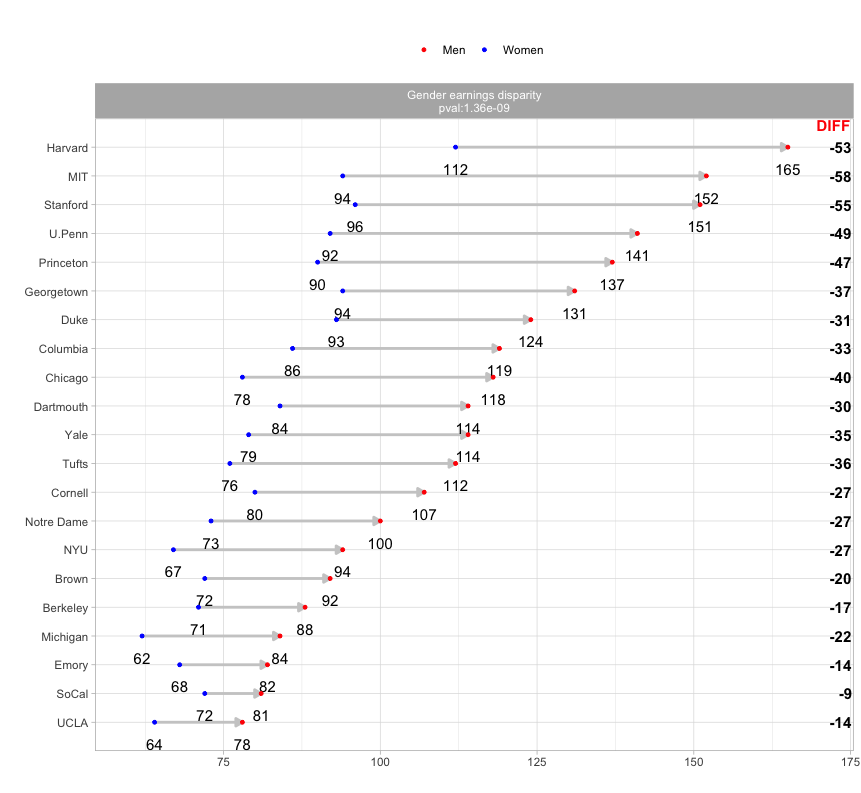

# dumbbell R Package: Some More Examples

## Step 1
Load libraries
<pre>
suppressPackageStartupMessages({
library(tidyverse)
library(ggplot2) 
library(rlang)
library(utils)
library(data.table)
library(dumbbell)

     
})
</pre>

## Step 2 
Get some data: Example data taken from https://plotly.com/r/dumbbell-plots/

<pre>
s <- read.csv("https://raw.githubusercontent.com/plotly/datasets/master/school_earnings.csv")
s$School <- factor(s$School, levels = s$School[order(s$Men)])
s1<-s %>% mutate("type" = 'Gender earnings disparity') 
</pre>

## Step 3 
Plot

<pre>
dumbbell::dumbbell(xdf=s1,id="School",key = "type", column1 = "Women", column2 = "Men", delt=1 ,arrow = 1, lab1 = "Women", lab2="Men", p_col1 = "red", p_col2 = "blue" ,pt_val = 1 , pval = 2, textsize = 3) + 
xlim(60,170) + 
facet_wrap( . ~ type)
</pre>

